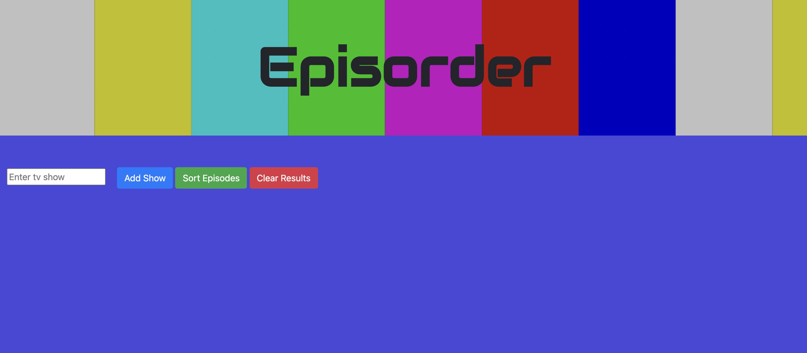

# Episorder

## Description

This is a web application that allows the user to search for any number of tv shows, and then sort their episodes based on air date. The purpose of this is to easily allow users to sort through any crossover episodes that related shows may have, as sometimes it can be difficult to know what order to watch these shows in.

## Link

https://dj620.github.io/episorder/

## Usage

When you navigate to the page, you can search for any tv show by entering it into the input box and clicking 'Add Show'. At this point, a modal window will open with all shows matching the search. Select the correct show by clicking on the picture of the show, and it will be added to the list of shows waiting to be sorted. Add as many shows as you'd like. Once you have added all the shows you want to sort, click 'Sort Episodes'. You will see every episode of all shows listed in order by their air date. If you want to make a new search, simply click 'Clear Results', and you can start a new search.

## Credits

This web application is made entirely possible by the Episodate API.

https://episodate.com

I took the font 'Audiowide' from Google fonts.

https://fonts.google.com

Formatting was made easy using Bootstrap.

https://getbootstrap.com

## Questions

For any questions, I, DJ Hersh, can be contacted via email at DanielJHersh@gmail.com

My GitHub profile is located at https://github.com/DJ620

## License

MIT License

Copyright (c) [2020] [DJ Hersh]

Permission is hereby granted, free of charge, to any person obtaining a copy
of this software and associated documentation files (the "Software"), to deal
in the Software without restriction, including without limitation the rights
to use, copy, modify, merge, publish, distribute, sublicense, and/or sell
copies of the Software, and to permit persons to whom the Software is
furnished to do so, subject to the following conditions:

The above copyright notice and this permission notice shall be included in all
copies or substantial portions of the Software.

THE SOFTWARE IS PROVIDED "AS IS", WITHOUT WARRANTY OF ANY KIND, EXPRESS OR
IMPLIED, INCLUDING BUT NOT LIMITED TO THE WARRANTIES OF MERCHANTABILITY,
FITNESS FOR A PARTICULAR PURPOSE AND NONINFRINGEMENT. IN NO EVENT SHALL THE
AUTHORS OR COPYRIGHT HOLDERS BE LIABLE FOR ANY CLAIM, DAMAGES OR OTHER
LIABILITY, WHETHER IN AN ACTION OF CONTRACT, TORT OR OTHERWISE, ARISING FROM,
OUT OF OR IN CONNECTION WITH THE SOFTWARE OR THE USE OR OTHER DEALINGS IN THE
SOFTWARE.